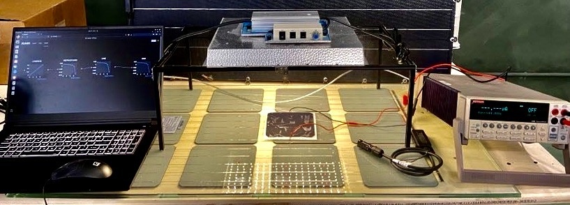
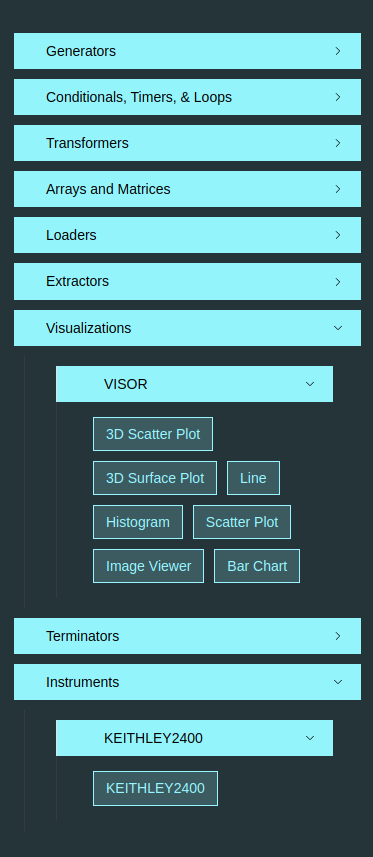
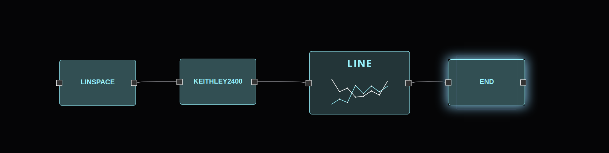
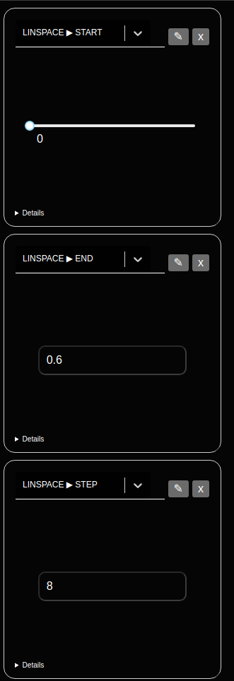
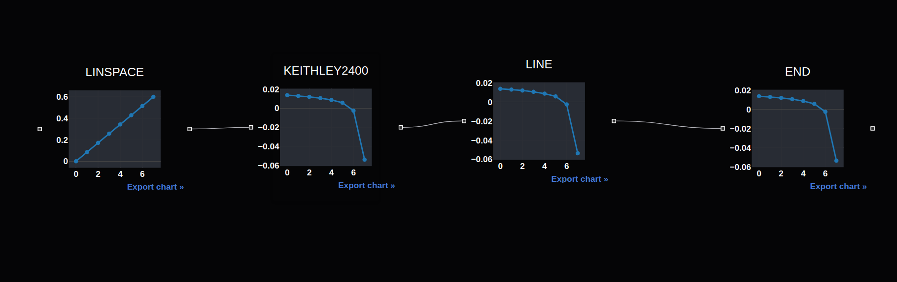

In this page, we will go through an example on how to record an Iv curve, using Flojoy, a Keithley2400 sourcemeter and a computer

Also covered will be a general guide on how to create a flojoy app including node parameters and saving the app. 

**HARDWARE** : In order to record an IV curve from an electric device (LED, Solar cells, etc,..) with Flojoy, you'll need a setup with :

- A Sourcemeter Keithley 2400, which is able to send voltages to the electronic device and record current from it. It has its own nodes in the Flojoy application called KEITHLEY2400.
- A source of light that you'll use as a fake sun for calibrating the output of your solar cells. (You can also use the real sun by doing the experiment outside)
- A computer which is connected to the Keithley 2400 with a serial communication cable. 

*Setup with a computer, a Keithley2400 sourcemeter, a solar cell for testing and artificial sun*

**SOFTWARE** : In order to record an IV curve you'll need to use our software Flojoy, you can follow these instructions https://docs.flojoy.io/getting-started/install/ in order to use the software on your computer

**PACKAGE** : 

  - After installing all the package from the Flojoy software you'll need to install the "pyserial" package : $ pip install pyserial, this will allow you to use serial communications with the Keithley 2400 to exchange data with him. 

**RUN FLOJOY** : When your setup is ready you can run the app Flojoy and start using it in order to record your IV curve, here are the steps to follow when opening the app : 

- Selecting the nodes you need for your IV curve : LINSPACE (in Generators, SIMULATION) ; KEITHLEY2400 (in Instruments, KEITHLEY2400) ; LINE (in Visualizations, VISOR) and finally END (in Terminator, TERMINATOR). Place them and connect them together on the graphical interface :  

*Choose the nodes you'll need from this menu*

After selecting your nodes from the menu you should have an interface similar to this :

*Classical setup for an IV curve measurement*

- Choosing the parameters for your experiment, you need to go to the Controle section by clicking on CTRLS and then toggle Edit, after that you can clisk on the button "add" and choose the type of parameters you want to add, to start we'll add NUMERIC INPUT to define our voltages range : 
  LINSPACE START : Define your first Voltage 
  LINSPACE END : Define your last Voltage 
  LINSPACE STEP : Define the number of voltages between the first and the last one. 
  
  Here's a look at the CRTL section after defining the LINSPACE parameters : 
  
  
  * Crtl section after defining the parameters for LINSPACE* 
  
- After that you'll need to select your serial communication parameters for the Comport, you'll need to add a TEXT INPUT : 
  KEITHLEY2400 COMPORT : Define your communication port where the sourcemeter is connected (Default is : /dev/tty/USBO (Linux))
  KEITHLEY2400 BAUDRATE : Define the Baud rate of your communication protocol (Default is : 9600, the value has to corresponds to the Instrument settings)
    
- Last step : When you have defined all your parameters, you should turn on your sourcemeter, place your solar cell under the light and click "PLAY" in order to start the experiment. The LINSPACE will generate data that will be send as voltage to the instrument and we'll record the output current from the solar cell. 

- The plot will be available in the "Debug" section where you can use your data and play with it using Plotly interface. 

  
- When you are done you can save the Flojoy interface in your computer, so you'll be able to use it again for other measurements. 
