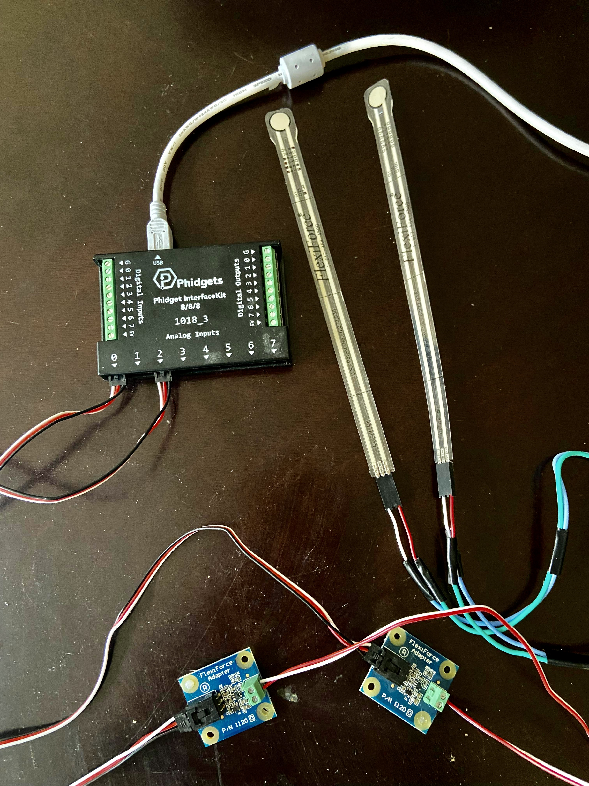
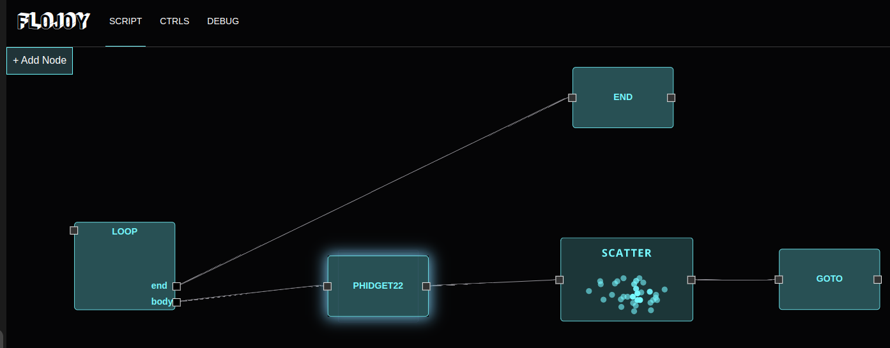
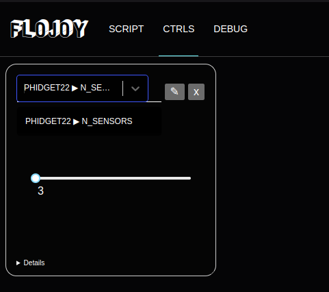

- This is a tutorial for using the node called Phidget 22 and measure pressures from Flexiforce sensors using a Phidget InterfaceKit

**Hardware required** : 
- A Phidget InterfaceKit (Model 8/8/8 1018_3 is the one we used to develop the node)
- N pressure sensors (This tutorial will present measurement from FlexiForce sensor but you can use all the Sensors compatible with Phidget).
- Connections cables (USB, Electronic cables)

**Software required :**
- Flojoy software running (Go to the page -- Getting started/Installation)
- Phidget 22 PAckage -- (It should be installed automatically from Requirements) (Otherwise follow docs from : https://www.phidgets.com/docs/Main_Page)

**Connection :** 
- Connect the PHIDGET Interfacekit to your computer with an USB Cable
- Connect the Flexiforce sensors with the Phidget Interfacekit using a Flexiforce adapter (See Image)

**Node Management :** 

The PHIDGET22 node doesn't need any data input, so it can be placed on the left on the Flojoy interface : 

You'll need to set up one numeric parameters in the CRTL panel which is the number of pressure sensors you are using for your experiment. 
Note that the node is measuring voltage from the sensors (The calibration will depend on the type of sensor you are using)

**Calibration :** 

In order to Calibrate your sensor, you'll need to apply some known pressures (3 or 4 is best, and you can use pad sensor to increase the voltage) 
and measure some voltages with the Flojoy application. 
From these measurements you deduce the relation between the voltage and the pressure applied on the sensor, and you can use operationnal
nodes in order to convert voltage into pressures.

**Visualisation :** 

After that you can choose your Visualisation node that fits your project to display the pressure measurements as you want.  

Also, you can use the loop node (See documentation) in order to update the measurements, you can set the parameters you want for the loops
(Delay, number of loops, etc..) 

